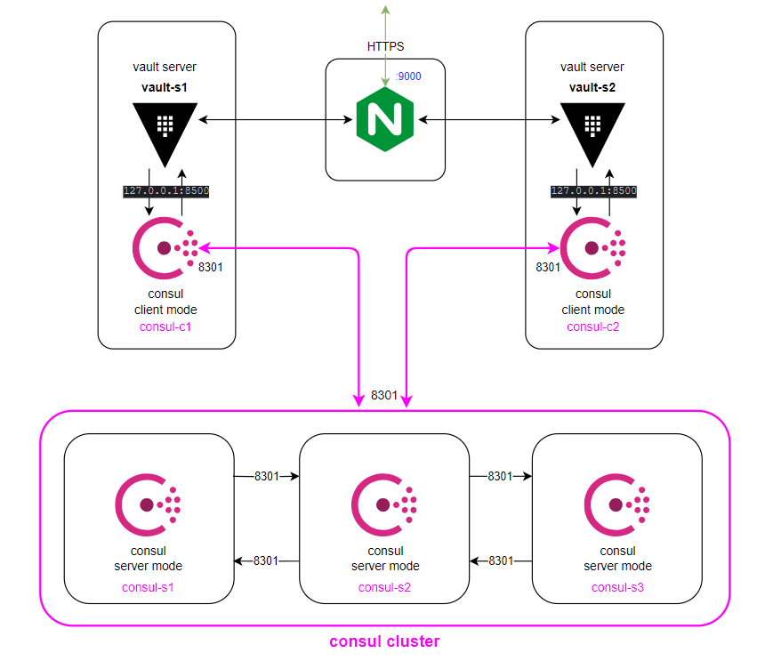

## Кластер Vault (HA)

Ansible playbooks для развертывания кластера Vault

---



Поместите исполняемые файлы необходимых версий consul и vault в папку `apps`.

Названия файлов должны быть `consul` и `vault`.


### Структура файла inventory

```ini
[nginx-balancer]
nginx ansible_host=

[nginx-balancer:vars]
schema=https
# IPs или domains для балансировки серверов vault
upstreams=["vault-s1", "vault-s2"]


[consul-servers]
consul-s1 ansible_host=
consul-s2 ansible_host=
consul-s3 ansible_host=

# Для данной системы Vault server располагается рядом со своим Consul client
# Так что:
# сервер vault-s1 будет являться consul-c1
# сервер vault-s2 будет являться consul-c2

[consul-clients]
consul-c1 ansible_host=
consul-c2 ansible_host=

[vault-servers]
vault-s1 ansible_host=
vault-s2 ansible_host=

[consul-cluster:children]
consul-servers
consul-clients

# Общие данные для кластера consul
[consul-cluster:vars]

# Общий ключ шифрования
encrypt=

# Название датацентра
datacenter=

```